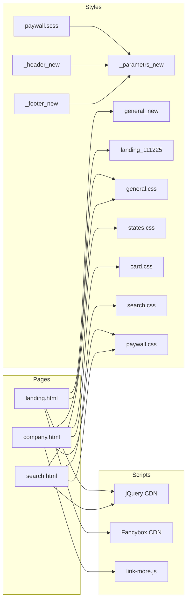
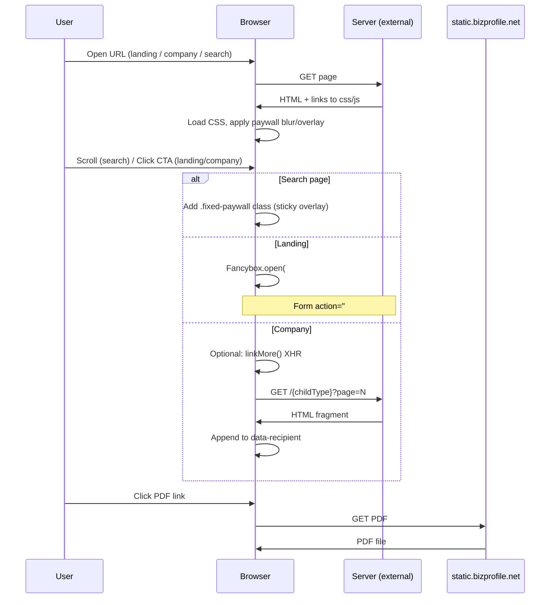

# 01-architecture.md

## Implemented architecture

This repository contains **frontend-only** static assets. There are no application layers (e.g. Domain, Application, Infrastructure) in the codebase; the “architecture” is the structure of pages, shared styles, and scripts.

### Layers (conceptual)

| Layer | Contents |
|-------|----------|
| **Presentation (HTML)** | `landing.html`, `company.html`, `search.html` — full-page markup, semantic sections, paywall wrappers. |
| **Styles (SCSS/CSS)** | `scss/` (partials and entry SCSS files), `css/` (compiled output). Variables and breakpoints in `_parametrs_new.scss` / `_parametrs.scss`. |
| **Scripts (JS)** | `js/jquery.main.js`, `js/jquery.init-slider.js`, `js/link-more.js` (and min), plus CDN: jQuery, Fancybox, Swiper. Inline script on `search.html` for sticky paywall. |
| **Assets** | Images, fonts, favicon in dedicated folders; referenced by URL in HTML and SCSS. |

Backend (routing, search, company data, paywall logic, email handling) is **not** in this repo.

### Modules / domains (by page and shared assets)

- **Landing** — Premium promo: hero, feature list, CTA, email popup, footer. Uses `general_new.css`, `landing_111225.css`, Fancybox.
- **Company** — Profile: header, breadcrumbs, filing info, paywalled contacts and filing blocks, document list, “other companies”, footer. Uses `general.css`, `states.css`, `card.css`, `paywall.css`, `link-more.min.js`.
- **Search** — Results list with paywalled table and sticky overlay. Uses `general.css`, `search.css`, `pagination_new.css`, `paywall.css`, `_fonts_new.css`, `_footer_new.css`; inline jQuery for fixed paywall.
- **Shared** — Header (`_header_new.scss` / `_header.scss`), footer (`_footer_new.scss` / `_footer.scss`), paywall component (`.paywall-wrapper`, `.paywall-overlay`, `.paywall-popup` in `paywall.scss`), design tokens (`_parametrs_new.scss`).

### Dependency rules

- SCSS partials depend on `_parametrs_new` or `_parametrs` for variables/mixins; `paywall.scss` also imports `_fonts_new`.
- HTML pages do not share a common template engine in-repo; header/footer are duplicated across pages (same structure, minor variants).
- Scripts: landing uses Fancybox + small inline script; company uses `link-more`; search uses inline scroll handler. No shared app bundle.

---

## Diagrams

### Modules and dependencies (high-level)

### Request / response and paywall flow

Only flows that are implemented in the repo are shown; server and payment flows are outside the repo.
