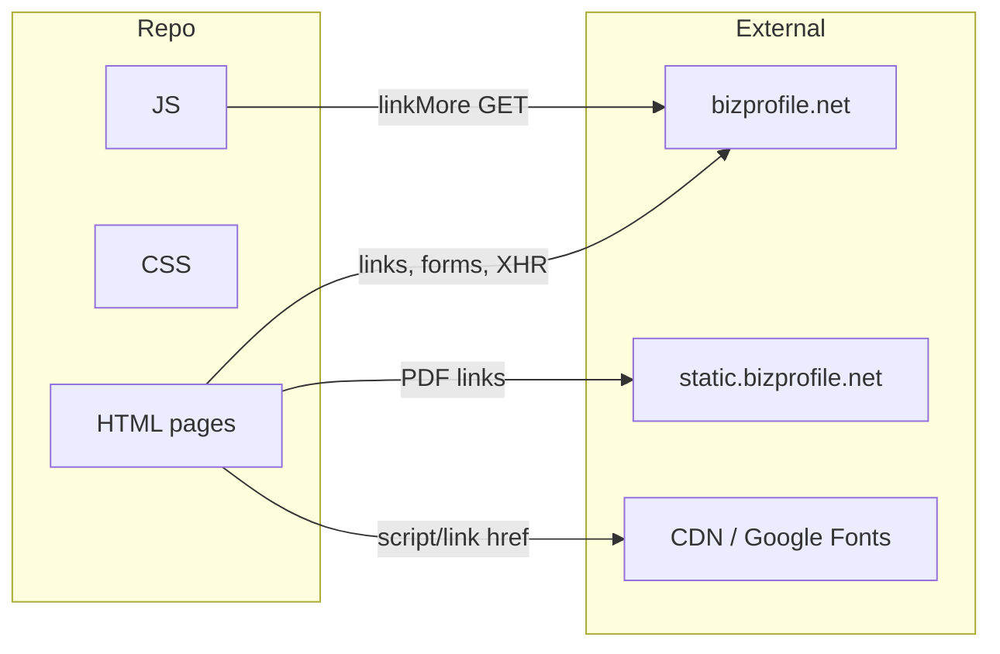

# 04-integrations-and-infra.md

## External services (referenced in repo)

| Service / host | Usage |
|----------------|--------|
| **bizprofile.net** | Main site: links in HTML (e.g. `/`, `/search`, `/about-us`, `/contactus`, `/fl`, `/privacy`, `/terms`), form `action="/search"`, meta `og:url`. Backend and routing are not in this repo. |
| **static.bizprofile.net** | PDF document URLs (e.g. `https://static.bizprofile.net/.../...pdf`). Used for company filing documents; `rel="nofollow"` on links. |
| **Google Fonts** | `fonts.googleapis.com` — Inter used on landing. |
| **CDN (jsDelivr)** | Fancybox CSS and UMD JS: `cdn.jsdelivr.net/npm/@fancyapps/ui@6.1/...`. |
| **jQuery CDN** | `code.jquery.com/jquery-3.7.1.min.js` (landing, search); company uses local `js/jquery-3.7.0.min.js`. |
| **Facebook, X, Threads** | Footer social links (bizprofile.net, BizprofileNET, @bizprofilesplashes). |
| **Email** | `mailto:info@bizprofile.net` in footer. |

No Stripe, payment gateway, CRM, or mail/SMS integration is present in this repository. Premium purchase and email capture are handled outside the repo (TODO: clarify with tech lead).

## Configuration

- **No `.env` or config files** in the repo. All URLs and origins are hardcoded in HTML and SCSS.
- **SCSS variables** in `scss/_parametrs_new.scss` (and `_parametrs.scss`): container width, breakpoints, colors, font family. Change there for global layout/theme.
- **Cache busting**: Some HTML references use query params on CSS/JS (e.g. `?v=...`). Not generated by a build in-repo; likely server or manual.

## Logging, monitoring, feature flags

- **None** in the codebase. No frontend logging, error tracking, or feature-flag libraries. Add only if agreed with tech lead and without guessing APIs.

## System ↔ external integrations (high-level)

Only integrations that appear in the repo are shown; payment or email backends are not included.
